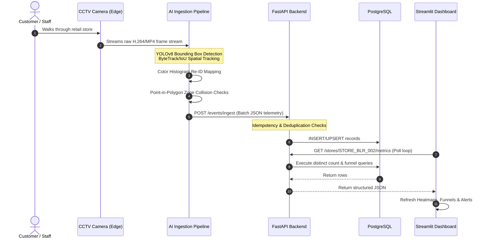
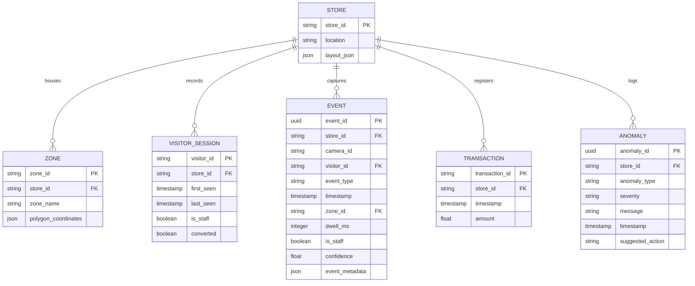

# System Architecture Design: Store Intelligence System

This document outlines the end-to-end system design, spatial mathematics, database schemas, and architectural blueprints for the **Apex Retail Store Intelligence System**.

---

## 1. End-to-End System Blueprint

The architecture is designed as a decoupled, multi-process streaming platform running containerized edge-to-cloud components:

---

## 2. Ingestion Pipeline & Computer Vision Mechanics

### A. Detection Layer & Spatial Bounding Box Tracking
*   **Object Detection (YOLOv8)**: The pipeline reads CCTV video frames (1080p, 15fps) and uses a pre-trained YOLOv8 model targeting class `0` (person) to generate bounding boxes $[X_{min}, Y_{min}, X_{max}, Y_{max}]$ with confidence scores.
*   **Bipartite IoU Tracking**: Bounding boxes are associated across consecutive frames using Intersection over Union (IoU) scores. A bipartite matching solver pairs tracks to maintain consistent local track IDs.

### B. Point-in-Polygon (PIP) Zone Mapping
To locate customers relative to physical retail counters (e.g., Skincare, Makeup, Billing) without using heavy external GIS libraries, the pipeline implements a native, Ray-Casting Point-in-Polygon (PIP) algorithm:
1.  **Coordinate Normalization**: Bounding boxes are normalized relative to frame height and width:
    $$x_n = \frac{x}{W}, \quad y_n = \frac{y}{H}$$
2.  **Floor Contact Extraction**: To represent where the shopper's feet contact the floor, the system evaluates the bottom-center coordinate of the bounding box:
    $$P_x = \frac{X_{1n} + X_{2n}}{2.0}, \quad P_y = Y_{2n}$$
3.  **Even-Odd Rule**: The Ray-Casting algorithm projects a horizontal ray from $P(P_x, P_y)$ and counts intersections with the polygon edges defined in `store_layout_camN.json`. If the intersection count is odd, the coordinate lies inside the zone.

### C. Visitor Re-Identification (Re-ID) & Double-Counting Prevention
Temporary occlusions (display racks, columns) or group crossings frequently split track trajectories, resulting in duplicate unique customer counts. The `ReIDEngine` resolves this:
*   **Color Histogram Signatures**: BGR color histograms (8 bins per channel, 512 total dimensions) are extracted from cropped person patches.
*   **Cosine Similarity**: When a track is lost and a new track is initialized nearby, the engine computes the cosine similarity between their color embeddings:
    $$\text{Similarity}(A, B) = \frac{A \cdot B}{\|A\| \|B\|}$$
*   **Temporal Association Gate**: If similarity exceeds a threshold ($\ge 0.85$) within a 10-minute sliding window, the new track is matched to the existing global `visitor_id`, preserving session continuity.

---

## 3. Database Schema Design

The normalized relational PostgreSQL schema supports fast analytical lookups, session history tracking, and transaction correlation:

---

## 4. API & Analytics Business Logic

### A. Idempotent Event Ingestion
CCTV edge pipelines can lose network connections and re-transmit batches of events, creating duplicated logs. The API gateway solves this:
*   Every telemetry event has a unique `event_id` (UUID-v4) generated at the edge.
*   The database schema enforces a `PRIMARY KEY` on `event_id`.
*    Fast API catches Postgres unique-constraint exceptions silently and returns a `200 OK` or `207 Multi-Status`, discarding duplicate payloads without pipeline downtime or analytics corruption.

### B. Spatial-Temporal POS Transaction Correlation
Offline customer checkout events are correlated with digital sales transactions using a spatial-temporal window search:
*   **Correlation Heuristic**: A customer session is marked as `converted = True` if they resided in the `billing` zone within a **5-minute sliding window** preceding a register receipt timestamp (`pos_transactions.csv`).
*   **Calculation**:
    $$\text{Conversion Rate} = \frac{\text{Unique Converted Customer Sessions}}{\text{Total Unique Customer Sessions}}$$

### C. Live Operations Alerts (Operational Anomalies)
The engine evaluates store behavior on-demand:
1.  **Queue Spikes (`QUEUE_SPIKE`)**: Warns store management if more than 5 unique shoppers are dwelling inside the `billing` zone simultaneously.
2.  **Dead Zones (`DEAD_ZONE`)**: Alerts staff if a primary cosmetic display records zero traffic during peak shopping hours.
