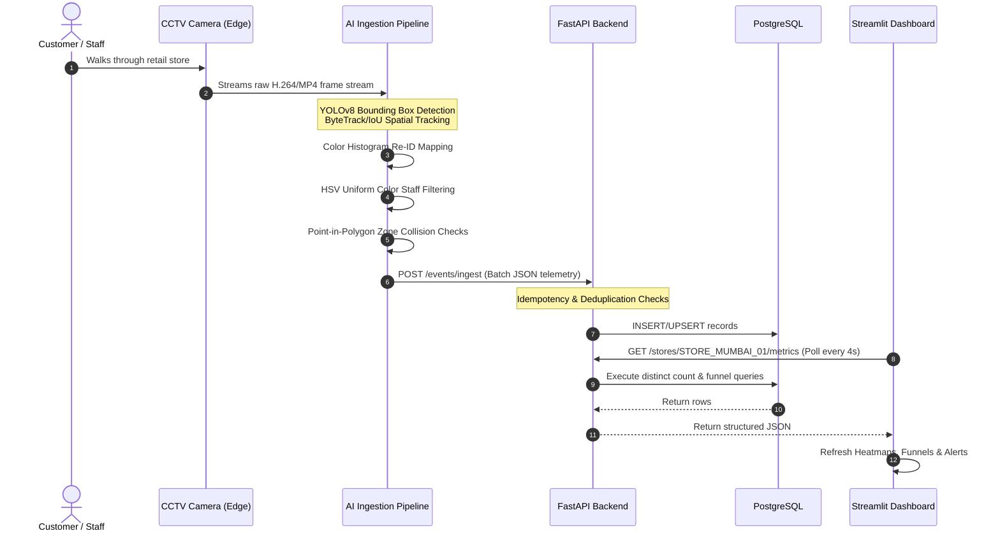
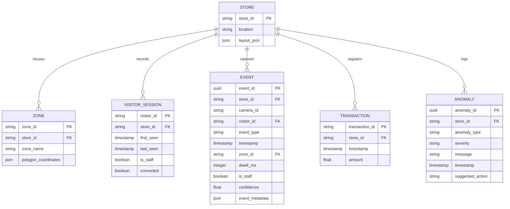

# System Architecture Design: Store Intelligence System

This document outlines the end-to-end system design, pipeline mechanics, and architectural blueprints for the **Purplle Store Intelligence System**.

---

## 1. Architectural Overview

The system is designed as a highly scalable, real-time edge-to-cloud intelligence platform consisting of four main decoupled service layers running inside a containerized environment:

1. **AI Processing Pipeline (Edge/Ingestion)**: Runs OpenCV, YOLOv8, and custom tracking/Re-ID components to process CCTV video feeds. It translates raw pixel streams into structured behavioral JSON telemetry.
2. **API Gateway (FastAPI Backend)**: Acts as the high-throughput ingestion endpoint (`/events/ingest`), validates schemas via Pydantic, applies deduplication/idempotency rules, and manages PostgreSQL transactions.
3. **Database Layer (PostgreSQL)**: Stores normalized relational schemas for stores, zones, shopper sessions, transactions, and anomalies.
4. **Analytics & Visualization Dashboard (Streamlit)**: Periodically polls the API for unified visitor metrics, conversion funnels, dwell-time heatmaps, and operational anomaly alerts.

---

## 2. Deep Dive: Ingestion Pipeline Mechanics

### A. Spatial Bounding & Bounding Box Tracking
1. **YOLOv8 Person Detection**: Every frame is processed to isolate `person` bounding boxes with confidence scores.
2. **IoU Tracking & ByteTrack**: Bounding boxes are matched across frames using Intersection over Union (IoU) metrics, assigning stable local track IDs.

### B. Visitor Re-Identification (Re-ID)
To handle occlusions, camera exit/re-entries, and lost tracks:
* The pipeline generates **color histogram embeddings** from cropped person patches using OpenCV (`cv2.calcHist`).
* When a track is lost and a new one starts, the ReID engine calculates the cosine similarity between the new person's embedding and the active registry.
* If similarity exceeds the threshold (`similarity_threshold = 0.85`) within a 10-minute window, the system links the new track to the same global `visitor_id`, preventing duplicate visitor counts.

### C. HSV Uniform Color Staff Filtering
To prevent store employees from skewing customer metrics, the system filters out staff dynamically:
* It crops the torso region of detected bounding boxes and converts the color space to **HSV (Hue, Saturation, Value)**.
* It applies strict mask ranges to detect specific uniform dress codes (e.g., Purplle store staff black/purple shirts).
* If the uniform pixel count exceeds a specific threshold, the visitor is classified as `is_staff = True`. Staff members are fully tracked for operational analytics (e.g., cashier queue dwell times) but excluded from store conversion funnels.

### E. Point-in-Polygon (PIP) Zone Mapping
To determine exactly which product section a shopper is browsing:
* The coordinates of the bottom-center of the bounding box (representing where the customer's feet touch the floor) are extracted and normalized between `[0.0, 1.0]`.
* The system runs a **Ray-Casting Point-in-Polygon (PIP) Algorithm** (Even-Odd Rule) against the 2D CAD polygons defined in `store_layout.json` to identify active zone collisions (e.g., `eb_korean`, `minimalist`, `makeup_unit`, `billing`).

---

## 3. API & Business Logic Layer

### A. Idempotency & Deduplication
To guarantee absolute reliability across networks, the `/events/ingest` endpoint implements database-level idempotency:
* Every telemetry event generated by the pipeline contains a unique UUID (`event_id`).
* When ingested, the backend runs a check. If an `event_id` already exists in PostgreSQL, the record is discarded/skipped safely (HTTP 200/207) without throwing errors or corrupting duplicate analytics.

### B. POS Transaction Correlation (Conversion Logic)
Store conversion rate calculations require connecting offline CCTV shoppers to digital POS register sales:
* When a sales receipt is posted via `/transactions`, the analytics service runs a spatial-temporal query:
  $$\text{Correlation Rule: } \text{Visitor Dwells in Billing Zone} \cap \text{POS Sale within 5 Minutes}$$
* If a non-staff visitor resided in the `billing` zone within 5 minutes prior to the receipt's timestamp, that visitor session is marked as `converted = True`.
* This prevents double-counting and accurately measures the percentage of physical store entries that lead to purchases.

### C. Dynamic Anomaly Alerts
Anomalies are computed in real-time on-demand:
1. **Queue Spikes (`QUEUE_SPIKE`)**: Triggers a `CRITICAL` or `WARN` alert if the number of unique customers dwelling in the `billing` checkout zone exceeds threshold limits (e.g., $>5$ active shoppers). Suggests opening additional registers.
2. **Conversion Drops (`CONVERSION_DROP`)**: Triggers an alert if visitor volume remains high but sales conversion rates fall below normal thresholds.

---

## 4. Database Schema Design

The PostgreSQL relational schema is structured as follows:

